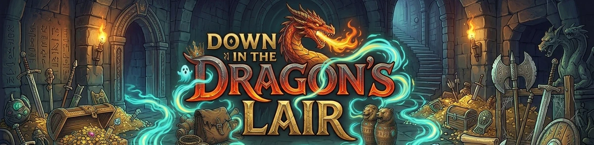
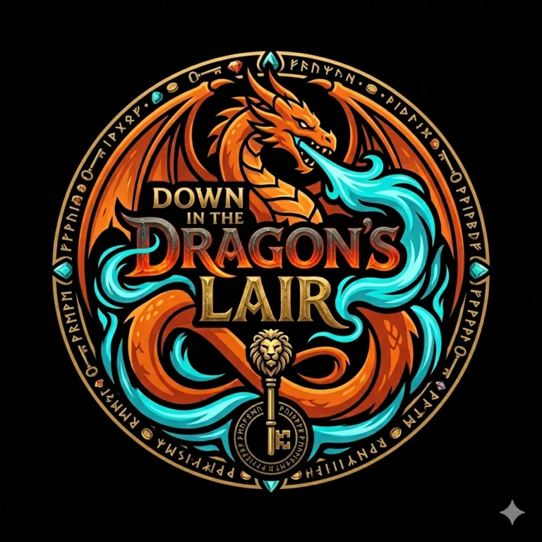

<h1 align="center">
  
</h1>

## Game
*Down in the Dragon's Lair* is a browser-based dungeon board game for 2 to 5 players. Play solo with one human-controlled hero against 1 to 4 AI opponents, or gather 2 to 5 human players around a single device in hotseat multiplayer mode, with a handoff overlay that keeps each player's turn private until the board is revealed again.

Your goal is to push deeper into the dungeon, survive its dangers, gather the right equipment, and reach the dragon's lair before your rivals can claim victory. Each turn combines exploration, tactical movement, combat, and risk management: revealing new tiles, navigating branching paths, fighting monsters, healing, collecting weapons, spells, and keys, and adapting to an evolving board state as the dungeon grows around the players.

Core features include deterministic game logic, AI-controlled opponents with configurable difficulty, hotseat multiplayer for several human players, seeded setups, persistent save/resume support, dungeon tile exploration, hero-specific loadouts, combat encounters, item and spell progression, English/German localization, and a full browser play experience backed by a dedicated UI and audio layer.

The current GitHub Pages version is playable here:
[Down in the Dragon's Lair on GitHub Pages](https://tnordsiek.github.io/down_in_the_dragons_lair/)

## Motivation
This is a small educational and hobby project that combines the enjoyable and interesting with the practical. In this specific case, the goal was to compile sufficiently detailed documentation of the requirements and robust guidelines that would enable Codex to independently create a fully functional core version of the game. 

## Technology
The project is built as a React frontend with TypeScript and Vite. The game rules run in a deterministic, testable engine, while UI, persistence, audio, and AI are separated into dedicated modules. Quality assurance relies on Vitest for unit and integration coverage, Playwright for end-to-end checks, and ESLint, Prettier, and a production build step for release verification.

For a more detailed, non-technical walkthrough of the project structure and the AI's decision-making, see [docs/project-guide.md](docs/project-guide.md) and [docs/ai-decision-making.md](docs/ai-decision-making.md).

## Development
Code powered by Codex & Claude

Graphics powered by Nano Banana

Concept and AI Direction by fnord GAMES (2026)

## Simulation Batch Runs
For local balancing checks, the repository now includes a terminal-based batch
simulation runner without GUI:

```powershell
npm run simulate -- --config=scripts/template.csv --raw=scripts/example-output-raw.csv --summary=scripts/example-output-summary.csv
```

- `scripts/template.csv` defines one scenario per row via
  `scenarioId,games,baseSeed,difficulty,poolScale,heroes`
- `heroes` is an ordered `|`-separated hero list such as
  `hero_mage|hero_blade|hero_rogue`
- `scripts/run-simulation-example.bat` contains the same preconfigured Windows
  example command
- `scripts/example-output-raw.csv` and `scripts/example-output-summary.csv`
  show representative output produced by the runner

For a derived balancing-oriented scorecard and ranking CSV, run:

```powershell
npm run analyze:sim -- --summary=scripts/example-output-summary.csv --raw=scripts/example-output-raw.csv --out=scripts/example-analysis-summary.csv
```

- `scripts/example-analysis-summary.csv` adds per-scenario hero rankings,
  a `balanceScore`, and raw-derived detail signals such as median treasure,
  low-HP rate, and best/worst seeds

For a local HTML report with scorecards, rankings, heatmap cells, and compact
seed/risk visuals, run:

```powershell
npm run report:sim -- --analysis=scripts/example-analysis-summary.csv --out=scripts/example-analysis-report.html
```

- `scripts/run-simulation-example.bat` now executes the full
  `simulate -> analyze -> report` pipeline with shared file paths
- `scripts/example-analysis-report.html` is the browser-friendly report target

The three steps above can also be run in one go via a single combined pipeline
script:

```powershell
npm run simulate:pipeline
```

<p align="center">
  
</p>
