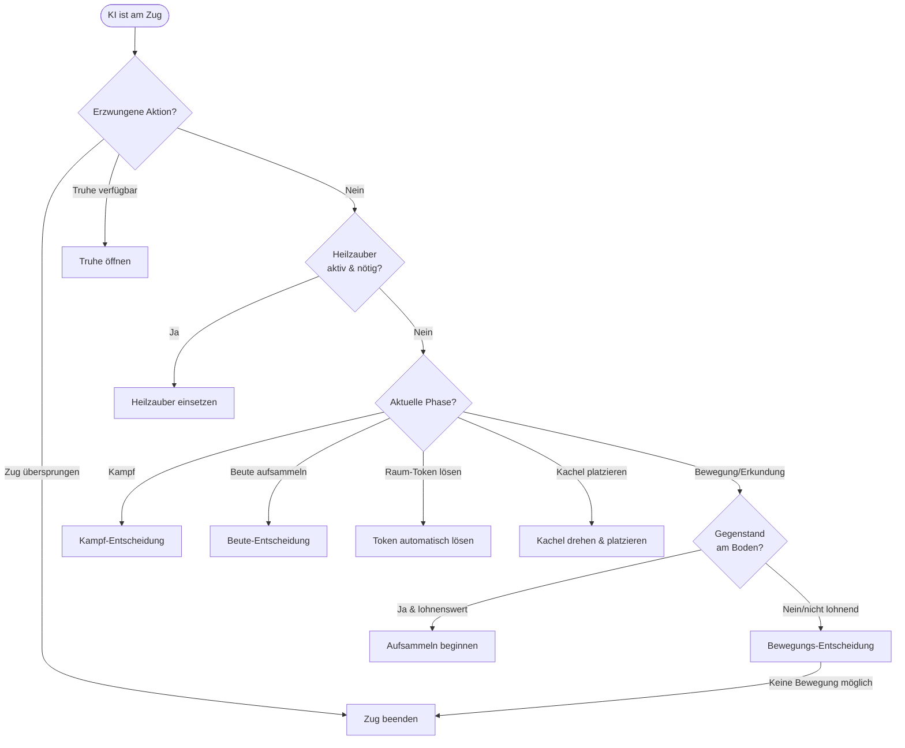

# KI-Entscheidungsfindung: Down in the Dragon's Lair

Dieses Dokument beschreibt, wie die KI im Spiel Entscheidungen trifft. Die KI ist ein **heuristischer Agent** – sie folgt expliziten Regeln und Bewertungsformeln, kein Machine Learning.

Der gesamte KI-Code liegt in `src/ai/`.

---

## Überblick: Was ist ein heuristischer Agent?

Statt einem neuronalen Netz oder Lernalgorithmus verwendet die KI einen simplen Prozess:

1. **Was darf ich tun?** – Alle erlaubten Aktionen für die aktuelle Spielphase werden ermittelt.
2. **Was ist am besten?** – Jede Aktion bekommt eine Punktzahl nach festen Regeln.
3. **Tue das Beste.** – Die Aktion mit der höchsten Punktzahl wird ausgeführt.

Dieser Prozess ist vollständig deterministisch: Gleiche Spielsituation → gleiche Entscheidung, immer.

---

## Das Grundprinzip: Phasenbasierte Entscheidungen

Das Spiel läuft in **Phasen** ab. Je nach Phase stehen andere Aktionen zur Verfügung, und die KI verwendet unterschiedliche Entscheidungslogik:



---

## Die vier Hauptentscheidungsbereiche

### 1. Bewegung & Erkundung

**Wann:** Phase `turn_start`, `await_move`, `optional_monster_combat`

Die KI bewertet jeden möglichen Zug mit einer **Punktzahl**. Der Zug mit der höchsten Punktzahl wird gewählt.

#### Heilung zuerst

Falls die KI **weniger als 3 Lebenspunkte** hat oder **verflucht** ist, ändert sich die Priorität komplett: Sie sucht den kürzesten Weg zu einer bekannten Heilungsposition.

```
Heilungs-Punktzahl = 12 − Entfernung zur Heilung
```

Je näher die Heilung, desto höher der Wert. Hat sie keine Heilung gefunden, ignoriert sie diesen Modus.

#### Normale Bewegungs-Punktzahl

Ohne Heilungsdruck setzt sich die Punktzahl aus mehreren Faktoren zusammen:

| Faktor | Wert | Erklärung |
|--------|------|-----------|
| **Neue Kachel aufdecken** | +9 | Ins Unbekannte erkunden → immer attraktiv |
| **Raum mit schlagbarem Monster betreten** | +8 | Angriff lohnt sich (≥50% Siegchance) |
| **Truhe auf Zielfeld** (mit Schlüssel) | +10 | Schatz einsammeln |
| **Truhe auf Zielfeld** (ohne Schlüssel) | +3 | Immerhin merken wo sie liegt |
| **Heilungsfeld als Ziel** (wenn HP niedrig) | +12 | Direkt hinlaufen |
| **Näher an Erkundungsfront** | +9 + Abstandsdifferenz | Progressives Erkunden |
| **Näher an bekanntem Ziel** (Monster, Truhe) | +6 + Abstandsdifferenz | Ziele verfolgen |
| **Drachen als Ziel** | +20 Prioritätsbonus | Der Drache ist das Hauptziel |
| **Monster mit <50% Siegchance auf Zielfeld** | −6 | Schwachen Monstern ausweichen |
| **Drache auf Zielfeld, kaum Siegchance** | −12 | Drachen meiden wenn zu schwach |
| **Zurück auf vorherige Position** | −2 | Hin-und-her vermeiden |

#### Wie wird Entfernung gemessen?

Für bekannte Felder verwendet die KI **BFS (Breitensuche)** – sie findet den tatsächlichen kürzesten Weg durch die Gänge. Für Heilungspositionen wird die einfachere **Manhattan-Distanz** (Schachbrett-Abstand) verwendet.

---

### 2. Kampfentscheidungen

**Wann:** Kampfphasen (`combat`, `combat_*`)

#### Wie berechnet die KI ihre Siegchance?

Die KI probiert **alle 36 möglichen Würfelkombinationen** (2× W6) durch und zählt, wie viele davon zum Sieg führen:

```
Siegchance = Anzahl siegreicher Würfelergebnisse ÷ 36
```

Beispiel: Ein Spieler mit Angriffswert 8 kämpft gegen ein Monster der Stärke 10. Die KI prüft alle Kombinationen von (1+1) bis (6+6) und errechnet so die exakte Wahrscheinlichkeit.

#### Schwellenwerte für optionale Kämpfe

| Situation | Mindestsiegchance | Quelle |
|-----------|-------------------|--------|
| Normales Monster (optional) | 20% | `minimumRepeatCombatWinChance` |
| Drache | 35% | `minimumDragonWinChance` |

Liegt die Siegchance darunter, weicht die KI aus (wenn möglich).

#### Flammen-Zauber im Kampf

Die KI setzt Flammen-Zauber sparsam ein: Sie sucht die **Mindestanzahl**, mit der sie noch gewinnt, und setzt nur diese ein. Ausnahme: Beim Magier-Helden werden keine Flammen-Zauber eingesetzt, da seine Fähigkeit Zaubereinsatz überflüssig macht. Gegen schwache Monster (Stärke ≤ 9) werden ebenfalls keine Zauber verschwendet.

#### Hexen-Opfer

Wenn die Hexin im Kampf das „Opfer"-Bonus anbieten kann, prüft die KI:

1. Führt das Opfer direkt zum Sieg? → **Opfer bringen**
2. Führt Opfer + Flammen-Zauber zum Sieg? → **Opfer bringen** (dann Zauber einsetzen)
3. Sonst → **Opfer ablehnen**

#### Valkyrie & Blade: Automatischer Würfelwurf

Die Valkyrie würfelt **immer neu** wenn möglich. Die Blade nutzt ihren Reroll **immer**. Beides geschieht automatisch ohne Abwägung.

---

### 3. Beute & Gegenstände

**Wann:** Phasen `loot_resolution` (Aufheben) und während Bewegung (Boden-Gegenstände)

#### Soll ich einen Gegenstand aufheben?

Bevor die KI sich bewegt, prüft sie ob ein Gegenstand auf dem aktuellen Feld liegt:

| Gegenstandstyp | Aufheben wenn… |
|----------------|----------------|
| **Schlüssel** | Kein Schlüssel im Inventar |
| **Waffe** | Weniger als 2 Waffen **oder** neue Waffe ist besser als schlechteste |
| **Zauber** | Weniger als 3 Zauber **oder** neuer Zauber hat höhere Priorität |

**Zauberprioritäten:** Flammen-Zauber (1) > Heilzauber (0)

#### Was tue ich mit dem aufgehobenen Gegenstand?

| Situation | Entscheidung |
|-----------|-------------|
| Schlüssel, Platz frei | Nehmen |
| Schlüssel, kein Platz | Liegenlassen |
| Waffe, Platz frei | Nehmen |
| Waffe, kein Platz, neue > schlechteste im Inventar | Schlechteste tauschen |
| Waffe, kein Platz, neue ≤ schlechteste | Liegenlassen |
| Zauber, Platz frei | Nehmen |
| Zauber, kein Platz, neue Priorität > niedrigste im Inventar | Niedrigsten Prioritätszauber tauschen |
| Zauber, kein Platz, Priorität gleich/niedriger | Liegenlassen |

---

### 4. Fluch-Zielauswahl

**Wann:** Phase `combat_curse_target` (nur beim Mumifizierten Priester)

Die KI verflucht immer den **Spieler mit den meisten Schatzpunkten** – also den Führenden. Das schwächt den stärksten Konkurrenten.

---

## Heldenspezifische Anpassungen

Verschiedene Helden haben Sonderfähigkeiten, die die Entscheidungslogik beeinflussen:

| Held | Fähigkeit | Auswirkung auf KI |
|------|-----------|-------------------|
| **Blade** | Würfel-Reroll im Kampf | Reroll wird immer genutzt (automatisch) |
| **Mage** | Kann durch Wände gehen | Mehr Bewegungsoptionen; keine Flammen-Zauber im Kampf |
| **Rogue** | Optionaler Kampf vor dem Weggehen | KI berechnet Siegchance und entscheidet ob sie kämpft |
| **Witch** | Positionstausch mit anderem Spieler | Tausch hat feste Punktzahl (8) und wird gegen Bewegung abgewogen |
| **Valkyrie** | Würfel-Reroll im Kampf | Reroll wird immer genutzt (automatisch) |
| **Seeress** | Wählt aus 2 gezogenen Raum-Tokens | Wählt immer die erste Option (Index 0) |

---

## Konfiguration & Schwierigkeitsgrad

Alle entscheidenden Zahlenwerte sind in [`src/ai/config.ts`](../src/ai/config.ts) gebündelt:

| Parameter | Wert | Bedeutung | Erhöhen bewirkt… |
|-----------|------|-----------|-----------------|
| `criticalHp` | 2 | HP-Grenze für Heilzaubereinsatz | KI heilt sich häufiger |
| `preferHealingBelowHp` | 3 | HP-Grenze für Heilungsweg-Priorisierung | KI priorisiert Heilung früher |
| `minimumRepeatCombatWinChance` | 0.2 | Mindest-Siegchance für optionale Kämpfe | KI geht mehr Risiko ein |
| `minimumDragonWinChance` | 0.35 | Mindest-Siegchance für Drachenkampf | KI greift Drachen früher/seltener an |
| `exploreTileBonus` | 9 | Bonus für Erkundung neuer Kacheln | KI erkundet aggressiver |
| `exploreRoomBonus` | 8 | Bonus für Betreten neuer Räume | KI geht öfter in Räume |
| `knownChestBonus` | 10 | Bonus für bekannte Truhen (mit Schlüssel) | KI priorisiert Schätze stärker |
| `knownHealingBonus` | 12 | Bonus für Heilungsfelder | KI sucht häufiger Heilung |
| `knownMonsterPenalty` | −6 | Strafe für nicht schlagbare Monster | KI meidet sie konsequenter |
| `objectiveProgressBonus` | 6 | Bonus für Fortschritt Richtung Ziele | KI verfolgt Ziele direkter |
| `dragonObjectiveBonus` | 20 | Prioritätsbonus für den Drachen | Drache wird früher/später priorisiert |
| `backtrackPenalty` | −2 | Strafe fürs Umkehren | KI läuft seltener hin und her |

---

## Beispielzug (Schritt für Schritt)

**Szenario:** Die KI ist dran. HP = 4, kein Fluch, keine Truhe in Reichweite. Es gibt 3 legale Aktionen:

- `movePlayer` → Feld (2, 1): bekanntes leeres Feld, einen Schritt näher an der Erkundungsfront
- `movePlayer` → Feld (2, 3): bekanntes Feld mit Monster (Stärke 12, Siegchance 19%)
- `declareExplorationDirection` → Richtung Norden: neue unbekannte Kachel aufdecken

**Schritt 1 – Erzwungene Aktionen?**
Kein Zug-Skip, keine Truhe. → Weiter.

**Schritt 2 – Heilzauber?**
HP = 4, nicht verflucht. Heilbedarf-Schwellenwert ist 3. → Kein Heilzauber.

**Schritt 3 – Kampfphase?**
Aktuelle Phase ist `await_move`. → Weiter zur Bewegungsentscheidung.

**Schritt 4 – Boden-Gegenstände?**
Kein Gegenstand auf aktuellem Feld. → Weiter.

**Schritt 5 – Bewegungs-Punktzahlen berechnen:**

| Aktion | Berechnung | Punktzahl |
|--------|-----------|-----------|
| `movePlayer` (2,1) | Näher an Erkundungsfront: +9 +1 Abstandsgewinn | **10** |
| `movePlayer` (2,3) | Monster, Siegchance 19% < 50%: −6 | **−6** |
| `declareExplorationDirection` Nord | Neue Kachel: fest +9 | **9** |

**Ergebnis:** `movePlayer` nach (2,1) gewinnt mit 10 Punkten.

---

---

## Bekannte Schwachstellen der aktuellen KI

Die folgenden Punkte wurden bei der Analyse identifiziert. Sie sind dokumentiert, aber bewusst noch nicht behoben (Scope-Kontrolle):

| # | Schwachstelle | Ort | Auswirkung |
|---|--------------|-----|-----------|
| 1 | **Heilzauber heilt nur sich selbst** | `chooseHealingSpellAction` (Filter `player.id === activePlayer.id`) | Andere Spieler werden ignoriert, auch wenn sie kritisch niedrige HP haben |
| 2 | **Seeress wählt immer Token-Index 0** | `resolve_room_token_seeress_choice` | Keine Auswertung welches der beiden Tokens besser ist |
| 3 | **Hexen-Positionstausch hat hardcoded Punktzahl** | `scoreMovementAction` (`exploreTileBonus - 1 = 8`) | Nicht kontextabhängig – ignoriert Spielerzustände beider Parteien |
| 4 | **Heilungsweg nutzt Manhattan- statt BFS-Distanz** | `distanceToNearestHealing` | Weniger präzise als die Wegfindung für Monster und Objectives |
| 5 | **Kein Spieler-Tracking** | gesamte `heuristicAgent.ts` | KI ignoriert Positionen und Stärken anderer Spieler vollständig |

---

## Schwierigkeitsgrade

Das Spiel unterstützt drei Schwierigkeitsgrade: **Easy**, **Normal** und **Hard**. Der Schwierigkeitsgrad wird beim Spielstart gesetzt und in `GameState.difficulty` gespeichert. `autoplay.ts` liest ihn aus und übergibt das passende Konfigurationsobjekt an `chooseHeuristicAiAction`.

### Parameter-Vergleich

| Parameter | Easy | Normal | Hard | Effekt der Erhöhung |
|-----------|------|--------|------|---------------------|
| `mistakeRate` | **0.2** | 0 | 0 | KI trifft öfter zufällige Entscheidungen |
| `criticalHp` | 3 | 2 | 2 | Heilzauber wird früher eingesetzt |
| `preferHealingBelowHp` | **4** | 3 | **4** | Weg zur Heilung wird früher priorisiert |
| `minimumRepeatCombatWinChance` | **0.1** | 0.2 | **0.3** | Optionale Kämpfe werden aggressiver/vorsichtiger gewählt |
| `minimumDragonWinChance` | **0.2** | 0.35 | **0.5** | Drache wird früher/später angegriffen |
| `exploreTileBonus` | **7** | 9 | **11** | Neue Kacheln werden mehr/weniger priorisiert |
| `exploreRoomBonus` | **6** | 8 | **10** | Räume werden mehr/weniger betreten |
| `knownChestBonus` | **8** | 10 | **12** | Truhen werden mehr/weniger priorisiert |
| `knownHealingBonus` | **14** | 12 | **10** | Heilungsfelder werden mehr/weniger priorisiert |
| `knownMonsterPenalty` | **−3** | −6 | **−8** | Unmögliche Monster werden mehr/weniger gemieden |
| `objectiveProgressBonus` | **4** | 6 | **8** | Ziele werden direkter verfolgt |
| `dragonObjectiveBonus` | **12** | 20 | **25** | Drache wird mehr/weniger als Hauptziel gewichtet |
| `backtrackPenalty` | **−1** | −2 | **−3** | Hin-und-her-Laufen wird mehr/weniger bestraft |

### Verhaltensprofile

**Easy** (`mistakeRate: 0.2`)
- 20 % aller Entscheidungen sind zufällig – die KI ignoriert die Scoring-Logik komplett
- Panikiert bei höheren HP und verschwendet Züge mit Heilungssuche
- Greift den Drachen zu früh an (bereits ab 20% Siegchance)
- Weicht Monstern kaum aus → nimmt mehr Schaden

**Normal** (aktuelle Standardwerte)
- Keine zufälligen Fehler
- Ausgewogene Erkundungs- und Kampfstrategie
- Kämpft den Drachen ab 35% Siegchance

**Hard** (`mistakeRate: 0`)
- Keine zufälligen Fehler
- Erkundet aggressiver, verfolgt Ziele direkter
- Wartet auf 50% Siegchance gegen den Drachen → startet den Endkampf stärker ausgerüstet
- Meidet unmögliche Kämpfe noch konsequenter

### Fehlerinjektion (Easy)

Die zufälligen Fehlentscheidungen bei Easy verwenden den seeded RNG aus `state.rng`. Da der RNG-Wert nur gelesen (nicht zurückgeschrieben) wird, beeinflusst die Fehlerinjektion den Spielfluss-RNG nicht:

```typescript
if (config.mistakeRate > 0) {
  const rng = restoreSeededRng(state.rng);   // lesen, nicht mutieren
  if (rng.next() < config.mistakeRate) {
    return legalActions[rng.nextInt(legalActions.length)];
  }
}
```

Gleicher `GameState` → gleiche Zufallszahl → identisches Verhalten bei jedem Testlauf.

### Empirische Testergebnisse

Validiert durch [`src/ai/difficultyBalance.test.ts`](../src/ai/difficultyBalance.test.ts):

| Test | Ergebnis |
|------|---------|
| Easy `mistakeRate` > Normal/Hard | ✅ |
| Hard kämpft Drachen erst bei höherer Siegchance als Easy | ✅ |
| Hard erkundet aggressiver (`exploreTileBonus` höher) | ✅ |
| Hard meidet Unmögliches konsequenter (`knownMonsterPenalty` tiefer) | ✅ |
| `getDifficultyConfig` liefert korrekte Presets | ✅ |
| Drachen-Endkampf bei allen 3 Schwierigkeitsgraden erfolgreich | ✅ |
| Hard weicht dem Drachen aus wenn Siegchance < 50% | ✅ |

---

## Dateienübersicht

| Datei | Inhalt |
|-------|--------|
| [`src/ai/heuristicAgent.ts`](../src/ai/heuristicAgent.ts) | Gesamte Entscheidungslogik |
| [`src/ai/config.ts`](../src/ai/config.ts) | Alle konfigurierbaren Gewichtungen + 3 Difficulty-Presets |
| [`src/ai/legalActions.ts`](../src/ai/legalActions.ts) | Erlaubte Aktionen je Phase |
| [`src/ai/autoplay.ts`](../src/ai/autoplay.ts) | Ausführung ganzer Züge/Spiele (difficulty-aware) |
| [`src/ai/difficultyBalance.test.ts`](../src/ai/difficultyBalance.test.ts) | Empirische Balance-Validierung |
| [`src/engine/core/types.ts`](../src/engine/core/types.ts) | `AiDifficulty`-Typ + `GameState.difficulty`-Feld |
