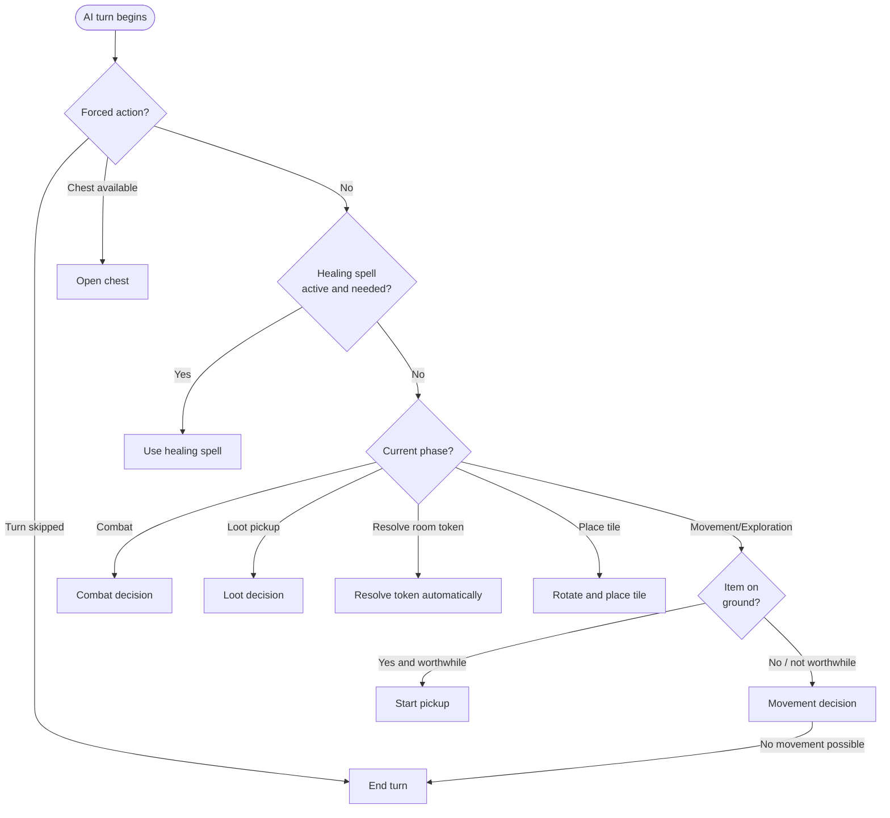

# AI Decision-Making: Down in the Dragon's Lair

This document explains how the AI makes decisions in the game. The AI is a **heuristic agent** - it follows explicit rules and scoring formulas, not machine learning.

All AI code lives in `src/ai/`.

---

## Overview: What is a heuristic agent?

Instead of using a neural network or learning algorithm, the AI uses a simple process:

1. **What am I allowed to do?** - Determine all legal actions for the current game phase.
2. **What is best?** - Assign a score to each action based on fixed rules.
3. **Do the best thing.** - Execute the action with the highest score.

This process is fully deterministic: same game state -> same decision, every time.

---

## The core principle: phase-based decisions

The game runs in **phases**. Depending on the current phase, different actions are available, and the AI uses different decision logic:



---

## The four main decision areas

### 1. Movement and exploration

**When:** phase `turn_start`, `await_move`, `optional_monster_combat`

The AI scores every possible move with a **point value**. The move with the highest score is chosen.

#### Healing first

If the AI has **fewer than 3 hit points** or is **cursed**, its priorities change completely: it looks for the shortest path to a known healing location.

```
Healing score = 12 - distance to healing
```

The closer the healing location, the higher the score. If no healing location is known, this mode is ignored.

> **Note on healing tiles:** Standing on a healing tile normally restores the player at the end of the turn. There is one exception enforced by the engine: if the player landed on the healing tile by being pushed back from a **lost combat** (a forced retreat), the end-of-turn healing is blocked. This is tracked via `state.healingEndTurnSource === 'combat_retreat_blocked'` and handled in `src/engine/rules/healing.ts`. The AI cannot heal "for free" by losing a fight next to a healing space.

#### Normal movement scoring

Without healing pressure, the score is built from multiple factors:

| Factor | Value | Explanation |
|--------|------:|-------------|
| **Reveal a new tile** | +9 | Exploring the unknown is always attractive |
| **Enter a room with a beatable monster** | +8 | Worth attacking (>=50% win chance) |
| **Chest on target tile** (with key) | +10 | Collect treasure |
| **Chest on target tile** (without key) | +3 | At least remember where it is |
| **Healing tile as target** (when HP is low) | +12 | Move there directly |
| **Closer to exploration frontier** | +9 + distance delta | Progressive exploration |
| **Closer to known objective** (monster, chest) | +6 + distance delta | Pursue objectives |
| **Dragon as objective** | +20 priority bonus | The dragon is the main objective |
| **Monster on target tile with <50% win chance** | -6 | Avoid unfavorable fights |
| **Dragon on target tile with very low win chance** | -12 | Avoid the dragon when too weak |
| **Return to previous position** | -2 | Avoid back-and-forth movement |

#### How is distance measured?

For known tiles, the AI uses **BFS (breadth-first search)** to find the actual shortest path through corridors. For healing locations, it uses the simpler **Manhattan distance**.

---

### 2. Combat decisions

**When:** combat phases (`combat`, `combat_*`)

#### How does the AI calculate its win chance?

The AI tries **all 36 possible dice combinations** (2x D6) and counts how many of them lead to victory:

```
Win chance = number of winning dice outcomes / 36
```

Example: a player with attack value 8 fights a monster with strength 10. The AI checks every combination from (1+1) to (6+6) and computes the exact probability.

#### Thresholds for optional fights

| Situation | Minimum win chance | Source |
|-----------|--------------------|--------|
| Normal monster (optional) | 20% | `minimumRepeatCombatWinChance` |
| Dragon | 35% | `minimumDragonWinChance` |

If the win chance is below the threshold, the AI avoids the fight when possible.

#### Flame spells in combat

The AI uses flame spells conservatively: it looks for the **minimum number** needed to still win, and uses only that many. Exception: the Mage hero never uses flame spells, because that hero ability makes spell use unnecessary. The AI also avoids wasting spells on weak monsters (strength <= 9).

#### Witch sacrifice

If the Witch can offer the "sacrifice" bonus in combat, the AI checks:

1. Does the sacrifice alone lead directly to victory? -> **Make the sacrifice**
2. Does sacrifice + flame spells lead to victory? -> **Make the sacrifice** (then use spells)
3. Otherwise -> **Decline the sacrifice**

#### Valkyrie and Blade: automatic rerolls

The Valkyrie **always rerolls** when possible. Blade **always uses** the reroll. Both happen automatically without further evaluation.

---

### 3. Loot and items

**When:** phases `loot_resolution` (pickup) and during movement (items on the ground)

#### Should I pick up an item?

Before moving, the AI checks whether there is an item on the current tile:

| Item type | Pick up when... |
|-----------|-----------------|
| **Key** | No key in inventory |
| **Weapon** | Fewer than 2 weapons **or** the new weapon is better than the worst current one |
| **Spell** | Fewer than 3 spells **or** the new spell has higher priority |

**Spell priorities:** Flame Spell (1) > Healing Spell (0)

#### What do I do with the picked-up item?

| Situation | Decision |
|-----------|----------|
| Key, free slot | Take it |
| Key, no slot | Leave it |
| Weapon, free slot | Take it |
| Weapon, no slot, new > worst in inventory | Replace the worst one |
| Weapon, no slot, new <= worst | Leave it |
| Spell, free slot | Take it |
| Spell, no slot, new priority > lowest in inventory | Replace the lowest-priority spell |
| Spell, no slot, equal/lower priority | Leave it |

---

### 4. Curse target selection

**When:** phase `combat_curse_target` (only for the Mummified Priest)

The AI always curses the **player with the most treasure points** - in other words, the current leader. This weakens the strongest competitor.

---

## Hero-specific adjustments

Different heroes have special abilities that affect decision logic:

| Hero | Ability | Effect on AI |
|------|---------|--------------|
| **Blade** | Combat dice reroll | Reroll is always used automatically |
| **Mage** | Can move through walls | More movement options; no flame spells in combat |
| **Rogue** | Optional combat before leaving | AI computes win chance and decides whether to fight |
| **Witch** | Position swap with another player | Swap gets a fixed score (8) and is weighed against movement |
| **Valkyrie** | Combat dice reroll | Reroll is always used automatically |
| **Seeress** | Chooses from 2 drawn room tokens | Always selects the first option (index 0) |

---

## Configuration and difficulty

All important numeric values are centralized in [`src/ai/config.ts`](../src/ai/config.ts):

| Parameter | Value | Meaning | Higher value causes... |
|-----------|------:|---------|------------------------|
| `criticalHp` | 2 | HP threshold for using healing spells | AI heals itself more often |
| `preferHealingBelowHp` | 3 | HP threshold for prioritizing healing routes | AI prioritizes healing earlier |
| `minimumRepeatCombatWinChance` | 0.2 | Minimum win chance for optional fights | AI takes more risk |
| `minimumDragonWinChance` | 0.35 | Minimum win chance for dragon combat | AI attacks the dragon earlier / less often |
| `exploreTileBonus` | 9 | Bonus for exploring new tiles | AI explores more aggressively |
| `exploreRoomBonus` | 8 | Bonus for entering new rooms | AI enters rooms more often |
| `knownChestBonus` | 10 | Bonus for known chests (with key) | AI prioritizes treasure more strongly |
| `knownHealingBonus` | 12 | Bonus for healing tiles | AI seeks healing more often |
| `knownMonsterPenalty` | -6 | Penalty for unbeatable monsters | AI avoids them more consistently |
| `objectiveProgressBonus` | 6 | Bonus for progress toward objectives | AI pursues objectives more directly |
| `dragonObjectiveBonus` | 20 | Priority bonus for the dragon | Dragon is prioritized earlier / later |
| `backtrackPenalty` | -2 | Penalty for turning back | AI moves back and forth less often |

---

## Example turn (step by step)

**Scenario:** It is the AI's turn. HP = 4, no curse, no chest in reach. There are 3 legal actions:

- `movePlayer` -> tile (2, 1): known empty tile, one step closer to the exploration frontier
- `movePlayer` -> tile (2, 3): known tile with a monster (strength 12, win chance 19%)
- `declareExplorationDirection` -> north: reveal a new unknown tile

**Step 1 - Forced actions?**  
No turn skip, no chest. -> Continue.

**Step 2 - Healing spell?**  
HP = 4, not cursed. The healing threshold is 3. -> No healing spell.

**Step 3 - Combat phase?**  
Current phase is `await_move`. -> Continue to movement decision.

**Step 4 - Items on the ground?**  
No item on the current tile. -> Continue.

**Step 5 - Calculate movement scores:**

| Action | Calculation | Score |
|--------|-------------|------:|
| `movePlayer` (2,1) | Closer to exploration frontier: +9 +1 distance gain | **10** |
| `movePlayer` (2,3) | Monster, win chance 19% < 50%: -6 | **-6** |
| `declareExplorationDirection` north | New tile: fixed +9 | **9** |

**Result:** `movePlayer` to (2,1) wins with 10 points.

---

---

## Known weaknesses of the current AI

The following issues were identified during analysis. They are documented, but intentionally not fixed yet (scope control):

| # | Weakness | Location | Impact |
|---|----------|----------|--------|
| 1 | **Healing spell only heals itself** | `chooseHealingSpellAction` (filter `player.id === activePlayer.id`) | Other players are ignored, even if they are critically low on HP |
| 2 | **Seeress always selects token index 0** | `resolve_room_token_seeress_choice` | No evaluation of which of the two tokens is better |
| 3 | **Witch position swap has a hardcoded score** | `scoreMovementAction` (`exploreTileBonus - 1 = 8`) | Not context-sensitive; ignores both players' current state |
| 4 | **Healing route uses Manhattan instead of BFS distance** | `distanceToNearestHealing` | Less precise than pathfinding for monsters and objectives |
| 5 | **Almost no player tracking** (partially addressed) | `heuristicAgent.ts` | The AI still ignores other players' positions and strength almost everywhere. The one exception is the dragon endgame: `shouldForceDragonEndgame` now compares its own dragon win chance against the best win chance among all players, so it only forces the final fight when it is the best-equipped contender. |

---

## Difficulty levels

The game supports three difficulty levels: **Easy**, **Normal**, and **Hard**. The difficulty is set when the game starts and stored in `GameState.difficulty`. `autoplay.ts` reads it and passes the matching configuration object into `chooseHeuristicAiAction`.

### Parameter comparison

| Parameter | Easy | Normal | Hard | Effect of increasing it |
|-----------|------|--------|------|--------------------------|
| `mistakeRate` | **0.2** | 0 | 0 | AI makes random decisions more often |
| `criticalHp` | 3 | 2 | 2 | Healing spell is used earlier |
| `preferHealingBelowHp` | **4** | 3 | **4** | Route to healing is prioritized earlier |
| `minimumRepeatCombatWinChance` | **0.1** | 0.2 | **0.3** | Optional fights are chosen more aggressively / cautiously |
| `minimumDragonWinChance` | **0.2** | 0.35 | **0.5** | Dragon is attacked earlier / later |
| `exploreTileBonus` | **7** | 9 | **11** | New tiles are prioritized more / less |
| `exploreRoomBonus` | **6** | 8 | **10** | Rooms are entered more / less |
| `knownChestBonus` | **8** | 10 | **12** | Chests are prioritized more / less |
| `knownHealingBonus` | **14** | 12 | **10** | Healing tiles are prioritized more / less |
| `knownMonsterPenalty` | **-3** | -6 | **-8** | Impossible monsters are avoided more / less |
| `objectiveProgressBonus` | **4** | 6 | **8** | Objectives are pursued more directly |
| `dragonObjectiveBonus` | **12** | 20 | **25** | Dragon is weighted more / less as the main objective |
| `backtrackPenalty` | **-1** | -2 | **-3** | Back-and-forth movement is penalized more / less |

### Behavior profiles

**Easy** (`mistakeRate: 0.2`)
- 20% of all decisions are random - the AI ignores scoring logic completely
- Panics at higher HP values and wastes turns searching for healing
- Attacks the dragon too early (already at 20% win chance)
- Barely avoids monsters -> takes more damage

**Normal** (current default values)
- No random mistakes
- Balanced exploration and combat strategy
- Fights the dragon at 35% win chance

**Hard** (`mistakeRate: 0`)
- No random mistakes
- Explores more aggressively and pursues objectives more directly
- Waits for a 50% win chance against the dragon -> starts the end fight better equipped
- Avoids impossible fights even more consistently

### Error injection (Easy)

The random mistakes on Easy use the seeded RNG from `state.rng`. Because the RNG value is only read (not written back), the mistake injection does not affect the gameplay RNG:

```typescript
if (config.mistakeRate > 0) {
  const rng = restoreSeededRng(state.rng);   // read, do not mutate
  if (rng.next() < config.mistakeRate) {
    return legalActions[rng.nextInt(legalActions.length)];
  }
}
```

Same `GameState` -> same random number -> identical behavior in every test run.

### Empirical test results

Validated by [`src/ai/difficultyBalance.test.ts`](../src/ai/difficultyBalance.test.ts):

| Test | Result |
|------|--------|
| Easy `mistakeRate` > Normal/Hard | PASS |
| Hard fights the dragon only at a higher win chance than Easy | PASS |
| Hard explores more aggressively (`exploreTileBonus` higher) | PASS |
| Hard avoids impossible fights more consistently (`knownMonsterPenalty` lower) | PASS |
| `getDifficultyConfig` returns the correct presets | PASS |
| Dragon endgame succeeds on all 3 difficulty levels | PASS |
| Hard avoids the dragon when win chance < 50% | PASS |

---

## File overview

| File | Contents |
|------|----------|
| [`src/ai/heuristicAgent.ts`](../src/ai/heuristicAgent.ts) | Full decision-making logic |
| [`src/ai/config.ts`](../src/ai/config.ts) | All configurable weights and the 3 difficulty presets |
| [`src/ai/legalActions.ts`](../src/ai/legalActions.ts) | Legal actions for each phase |
| [`src/ai/autoplay.ts`](../src/ai/autoplay.ts) | Execution of full turns/games (difficulty-aware) |
| [`src/ai/difficultyBalance.test.ts`](../src/ai/difficultyBalance.test.ts) | Empirical balance validation |
| [`src/engine/core/types.ts`](../src/engine/core/types.ts) | `AiDifficulty` type, `GameState.difficulty` field, and the `HealingEndTurnSource` type |
| [`src/engine/rules/healing.ts`](../src/engine/rules/healing.ts) | End-of-turn healing rule, including the blocked retreat-after-lost-combat case |
