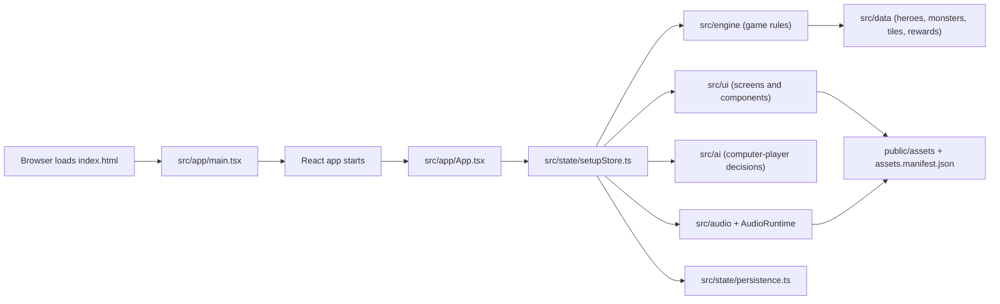
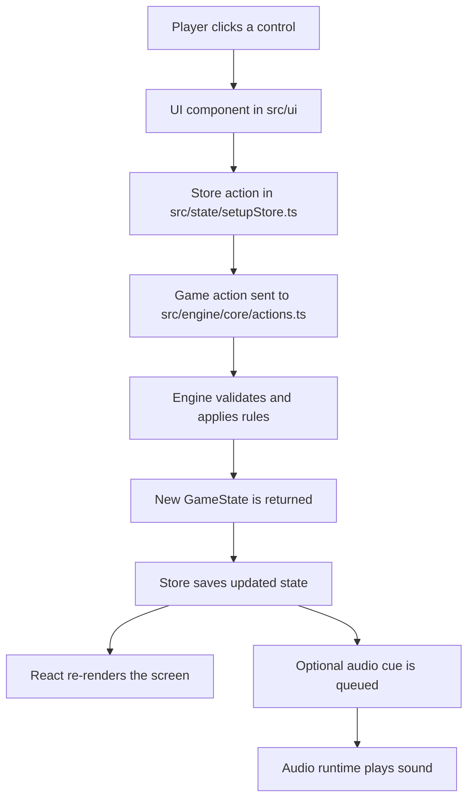
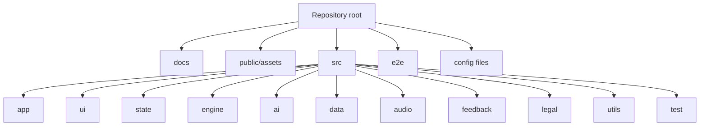

# Down in the Dragon's Lair: Project Guide for Non-Developers

## Table of Contents

1. [What This Project Is](#what-this-project-is)
2. [Key Ideas First](#key-ideas-first)
3. [Technology Stack and What Each Tool Is For](#technology-stack-and-what-each-tool-is-for)
4. [How the System Works Together](#how-the-system-works-together)
5. [Typical Flows Inside the Project](#typical-flows-inside-the-project)
6. [Folder-by-Folder Explanation](#folder-by-folder-explanation)
7. [File Categories and What They Mean](#file-categories-and-what-they-mean)
8. [Game Content vs Technical Infrastructure](#game-content-vs-technical-infrastructure)
9. [Generated Files vs Hand-Maintained Files](#generated-files-vs-hand-maintained-files)
10. [Testing and What It Protects](#testing-and-what-it-protects)
11. [Sensitive Areas When Changing the Project](#sensitive-areas-when-changing-the-project)
12. [Glossary of Important Terms](#glossary-of-important-terms)
13. [Recommended Future Documentation Additions](#recommended-future-documentation-additions)
14. [Why Markdown Is the Right Format Here](#why-markdown-is-the-right-format-here)

## What This Project Is

*Down in the Dragon's Lair* is a browser-based dungeon board game. One human player chooses a hero and competes against computer-controlled opponents. During play, the dungeon grows tile by tile, players move through corridors and rooms, monsters appear, treasure can be collected, and the game ends when the dragon is defeated and victory conditions are resolved.

For a non-technical reader, it helps to separate the project into three layers:

- **The game concept**: the fantasy setting, heroes, monsters, dungeon tiles, treasure, healing spaces, combat, and victory rules.
- **The game rules**: the exact logic that decides what is allowed, what happens during a turn, how combat works, and how the winner is determined.
- **The software**: the code that shows the game in the browser, remembers the current game, plays sound, lets the AI take turns, and checks that everything behaves correctly.

When you open the game in a browser, you are not downloading a large game engine like a desktop game would. Instead, the browser loads a web application. That application draws the screens, holds the live game state in memory, reacts to clicks, and updates the board after every action.

This repository contains everything needed for that web application:

- the rules of the game,
- the user interface,
- the AI behavior,
- the images and sounds,
- the save/load logic,
- the tests used to confirm the project still works.

Before diving into the technology and folders, it helps to lock down a few recurring ideas. These terms appear throughout the guide, and understanding them early makes the rest much easier to follow.

## Key Ideas First

This section is a quick orientation layer for readers who do not usually work with software projects.

### Game state

The **game state** is the current snapshot of the game: whose turn it is, where players stand, what items they carry, what the board looks like, and what phase the game is in.

### Store

The **store** is the central place where the app keeps its live information while the game is running. It helps the visible interface and the rule logic stay in sync.

### Engine

The **engine** is the part of the code that enforces the rules. It decides what is allowed and what changes after an action happens.

### Asset

An **asset** is a media file used by the game, such as an image, sound effect, music track, or icon.

### Deterministic

**Deterministic** means the same input produces the same result. In this project, that matters because the same seed and the same situation should lead to the same rule and AI outcomes.

### Build

A **build** is the packaged version of the project that is ready to be published as a website instead of being run as editable source code.

## Technology Stack and What Each Tool Is For

This section explains the main technologies in plain language. These are the important tools that make the project run and stay maintainable.

### Node.js

Node.js is the general runtime used for development tasks. It is not the game itself. Instead, it is the environment used to:

- install project dependencies,
- start the local development server,
- build the production version,
- run automated tests,
- run quality checks such as linting and formatting.

The project expects **Node 22 or newer**.

### React

React is the library that builds the visible interface in the browser. It is responsible for screens such as:

- the start screen,
- the tutorial screen,
- the main game screen,
- dialogs and panels,
- buttons, logs, hero displays, and board overlays.

You can think of React as the system that says: "given the current game state, what should the player see right now?"

### TypeScript

TypeScript is the main programming language used in the project. It is based on JavaScript, the standard language of the browser, but adds stronger structure and clearer definitions.

That matters here because the project has many named concepts:

- heroes,
- monsters,
- items,
- game phases,
- actions,
- board positions,
- combat data,
- saved game data.

TypeScript helps the code describe those concepts precisely and makes mistakes easier to catch before the game is shipped.

### Vite

Vite is the tool that runs the app during development and builds the production version. In practice, it does two important jobs:

- it launches the local web app quickly for testing while developing,
- it bundles the project into static files that can be deployed to a website such as GitHub Pages.

The project uses `vite.config.ts` to configure this behavior.

### Zustand

Zustand is the state management library used by the app. It stores the live, changing state of the application outside of the visible components.

In this project, Zustand is the layer that remembers things such as:

- which hero the player selected,
- whether a game is currently running,
- what the latest `GameState` is,
- whether sound is enabled,
- whether a save file exists,
- whether the feedback dialog is open,
- which audio cues still need to be played.

This makes it the bridge between the game rules and the user interface.

### Tailwind CSS

Tailwind CSS controls styling and layout. It is the visual utility system used to define:

- spacing,
- typography,
- colors,
- responsive layout behavior,
- borders, panels, shadows, and screen structure.

It does not decide game rules. It decides how things look and fit together on screen.

### Vitest

Vitest is the main automated testing tool for unit and integration tests. It checks whether small and medium-sized parts of the project work correctly.

Examples of what it tests in this repository:

- game-rule logic,
- AI legal action handling,
- state persistence,
- audio controller behavior,
- UI components,
- deterministic randomness behavior,
- serialization and deserialization of save data.

### Playwright

Playwright is used for end-to-end browser tests. These are higher-level checks that behave more like a real user. Instead of testing one function in isolation, they open the built app in a browser and confirm key flows still work.

In this project, Playwright covers important user-facing scenarios such as the start screen and endgame behavior.

### ESLint

ESLint is a code-quality checker. It scans the code for risky patterns, mistakes, and style issues that matter for maintainability.

### Prettier

Prettier is a formatting tool. Its job is not gameplay correctness, but consistency. It makes the source files use the same spacing, line wrapping, and punctuation style, which makes the project easier to read and review.

### Additional Supporting Tools

Other important pieces in the stack include:

- `@vitejs/plugin-react`: connects React to Vite.
- `jsdom`: allows browser-like testing behavior in Vitest.
- `@testing-library/react` and `@testing-library/jest-dom`: help test React components in a realistic way.
- `PostCSS` and `Autoprefixer`: support CSS processing.

## How the System Works Together

The project is easier to understand if you treat it as a set of cooperating subsystems instead of one giant block of code.

### High-Level System Overview

### Startup Flow

The visible app starts in a simple chain:

1. `index.html` provides the page shell.
2. `src/app/main.tsx` boots React and loads global styles and fonts.
3. `src/app/App.tsx` decides which major screen to show:
   - start screen,
   - tutorial screen,
   - game screen.
4. `src/state/setupStore.ts` provides the current application state to the rest of the app.

### The Store as the Middle Layer

The most important coordination layer is `src/state/setupStore.ts`.

It does not contain all rules, and it does not draw the full UI by itself. Instead, it acts as the central coordinator that:

- keeps the current setup choices,
- stores the active `GameState`,
- starts a new game,
- resumes a saved game,
- dispatches player actions into the engine,
- stores audio preferences,
- queues sound effects,
- records UI-facing error messages.

If you want one sentence that explains the store:

> The store is the live control room of the application.

### The Game Engine

The real rule logic lives in `src/engine`.

This is the part that answers questions such as:

- Whose turn is it?
- How many movement points remain?
- Which moves are legal?
- What happens when a tile is explored?
- What happens when combat is resolved?
- Can a chest be opened?
- Can an item be carried?
- Is the game over?

This separation is important. The UI does not directly decide game outcomes. The engine does.

### The User Interface

The UI lives mostly in `src/ui`.

This part decides how the player interacts with the game:

- which buttons are visible,
- how the board is shown,
- how events are presented,
- how panels are laid out,
- how tutorial content is displayed,
- how player information is shown.

It is the "presentation layer" of the game.

### The AI

Computer-controlled opponents are handled in `src/ai`.

The AI does not replace the engine. It uses the same game state and legal action information, then chooses a move for AI players. In other words:

- the engine says what is allowed,
- the AI chooses from those allowed actions.

The existing detailed AI explanation is documented separately in [ai-decision-making.md](./ai-decision-making.md).

### Assets: Images, Sounds, and UI Media

The project includes images and audio in `public/assets`, while `assets.manifest.json` describes those assets in a structured way. The code uses `src/data/assets.ts` to read that manifest and build usable URLs for the app.

That means the visual and audio content is not hardcoded directly inside most components. Instead, the app asks for assets by ID, such as a hero portrait, a tile image, or a sound effect.

### Saving and Loading

The save system lives in `src/state/persistence.ts` and uses the browser's local storage.

This lets the project:

- save the current game state inside the player's browser,
- reload it later,
- remove invalid saved data if it can no longer be read safely.

### Audio

Audio is handled by a combination of:

- `src/app/AudioRuntime.tsx`,
- `src/audio/runtimeAudio.ts`,
- store-managed pending audio cues.

The store decides **what should be played**, and the runtime audio layer decides **how to play it in the browser**.

### Feedback and Diagnostics

The feedback system lets a player prepare an email with optional diagnostics. The relevant code in `src/feedback` builds a compact technical summary of the current game state, including version, seed, phase, and recent events. This helps with bug reporting without dumping the full board state.

### Player Action Flow

### Folder Map

Now that the major parts are identified, it helps to look at them in motion before looking at the repository as a directory tree. The next section shows what the project actually does during common game and app actions.

## Typical Flows Inside the Project

This section explains how major game activities move through the system.

### 1. Starting a Game

1. The player opens the start screen.
2. The player chooses a hero, difficulty, and AI setup.
3. The store calls the game-start action.
4. The engine creates a new `GameState`.
5. The new state is saved in the store.
6. The game screen appears.
7. The game state is also saved to browser storage so it can be resumed later.

### 2. Taking a Player Action

1. The player clicks a button or a board location.
2. A UI component captures that choice.
3. The component asks the store to dispatch a `GameAction`.
4. The engine applies the rules for that action.
5. A new state comes back.
6. React redraws the interface based on that updated state.
7. If needed, the app also queues a sound effect.

### 3. AI Taking a Turn

1. The game screen notices that the active player is AI-controlled.
2. The app gathers legal AI actions.
3. The AI logic evaluates those options.
4. The best legal action is chosen.
5. That action is sent through the same store-and-engine path used by human actions.

This is important: the AI does not have a different hidden rules path. It plays through the same state system.

### 4. Resolving Combat

1. A move or event leads into combat.
2. The engine sets combat-related state.
3. The UI presents the relevant options for the current combat phase.
4. Dice, hero abilities, and spells are processed according to the rules.
5. The outcome becomes part of the event log and may trigger loot, damage, or follow-up phases.

### 5. Saving and Resuming

1. When state changes, the current game can be serialized.
2. That serialized form is stored in browser local storage.
3. On a later visit, the app tries to read it back.
4. If the data is valid, the saved game can be resumed.
5. If the data is broken or outdated in an invalid way, it is removed safely.

### 6. Triggering Audio

1. A game or UI action happens.
2. The store decides whether that event should produce audio.
3. It queues a pending audio cue.
4. `AudioRuntime.tsx` sees the cue.
5. The runtime audio controller plays the correct sound effect or switches music tracks.

### 7. Sending Feedback with Diagnostics

1. The player opens the feedback interface.
2. The player writes a message and can optionally include diagnostics.
3. The app builds a compact summary of relevant game information.
4. A `mailto:` link is assembled with subject and body already filled in.
5. The player's email client opens with the message prepared.

## Folder-by-Folder Explanation

With those flows in mind, the folder structure becomes easier to interpret. The next section explains where each major part lives in the repository and what kinds of responsibilities are grouped there.

This section explains the most important directories and root-level files in the repository.

### Repository Root

The root contains the overall project definition and project-wide instructions.

Important files include:

- `README.md`: short public-facing overview of the game and project.
- `STATUS.md`: current project status and recent verification notes.
- `HANDOFF.md`: temporary resume notes for interrupted work.
- `AGENTS.md`: instructions for AI coding agents working in the repository.
- `package.json`: dependency list and development commands.
- `package-lock.json`: exact locked dependency versions.
- `vite.config.ts`: Vite and Vitest configuration.
- `playwright.config.ts`: end-to-end test configuration.
- `eslint.config.js`: linting rules.
- `tailwind.config.js`: Tailwind setup and design tokens.
- `postcss.config.js`: CSS processing configuration.
- `tsconfig.json`, `tsconfig.app.json`, `tsconfig.node.json`: TypeScript configuration.
- `index.html`: HTML entry page for the app.
- `assets.manifest.json`: structured description of game assets.

### `docs`

This folder stores human-readable project documentation.

Current contents include:

- `ai-decision-making.md`: deeper explanation of AI behavior.
- `project-guide.md`: this plain-English project guide.

This is the right place for long-form documentation that should live with the code.

### `public/assets`

This folder contains browser-served asset files such as:

- hero images,
- monster images,
- item images,
- tile images,
- UI images,
- sound effects,
- music tracks,
- status icons.

The app can load these directly because the `public` folder is meant for static files.

Subfolders currently include:

- `heroes`
- `items`
- `monsters`
- `sounds`
- `status`
- `tiles`
- `ui`

### `src`

This is the main source code folder. It contains the actual application logic.

#### `src/app`

This folder contains the application shell and the first React entry points.

Typical responsibilities:

- booting the app,
- loading global styling,
- deciding which top-level screen is shown,
- running the audio runtime.

Important files:

- `main.tsx`
- `App.tsx`
- `AudioRuntime.tsx`
- `styles.css`

#### `src/ui`

This folder contains the visible interface. It is the largest "player-facing" source area.

Subareas include:

- `screens`: top-level screens such as start, tutorial, and game.
- `components`: larger reusable UI building blocks such as the board view, action panel, event log, settings menu, and feedback modal.
- `primitives`: smaller reusable building blocks such as buttons, chips, panels, and headings.
- `tutorial`: tutorial-specific display pieces and fixtures.

Other files in this area define:

- labels,
- tooltips,
- item display helpers,
- selection-state helpers,
- tutorial step content.

#### `src/state`

This folder manages live application state and browser persistence.

Important roles here:

- central setup and game store,
- audio preference persistence,
- save/load game persistence using local storage.

This is one of the most important glue layers in the whole project.

#### `src/engine`

This folder contains the actual game rules and state transitions. It is the heart of the game logic.

Subareas include:

- `core`: shared types, state actions, board logic, event creation.
- `setup`: creating a new game.
- `movement`: reachable spaces, exploration, movement execution, board topology.
- `combat`: combat resolution and combat-specific rule handling.
- `rules`: abilities, chests, healing, inventory, rooms, spells, and hero-specific rules.
- `turns`: turn-phase handling and continuation rules.
- `serialization`: saving/loading game state to JSON.
- `victory`: winner scoring and dragon-end resolution.

If someone asked "where are the rules really enforced?", this is the main answer.

#### `src/ai`

This folder handles computer-player behavior.

Important responsibilities:

- finding legal AI actions,
- scoring possible choices,
- picking a move for an AI turn,
- autoplay behavior,
- AI-focused regression and determinism tests,
- difficulty presets and configuration.

This area is especially important because the AI must stay compatible with the same rule engine the human player uses.

#### `src/data`

This folder stores structured game content and display metadata.

Examples:

- hero definitions,
- monster definitions,
- reward definitions,
- tile pool definitions,
- token bag content,
- display names,
- asset metadata access.

This is the nearest thing the project has to a "content database," except it is stored as source files rather than in a separate external database.

#### `src/audio`

This folder contains the runtime audio controller logic. It is responsible for turning requested audio events into actual browser audio playback.

#### `src/feedback`

This folder supports player feedback and diagnostics.

Examples:

- application version string,
- feedback email assembly,
- compact diagnostics summary generation.

#### `src/legal`

This folder stores website and project legal information, such as:

- privacy policy content,
- imprint content,
- contact details,
- related legal types.

#### `src/utils`

This folder contains general helper logic that does not belong to one specific domain area.

In the current codebase this includes random-seed and RNG helpers, which are important because reproducible randomness is a major project feature.

#### `src/test`

This folder contains shared testing utilities rather than production gameplay code.

Examples:

- common test setup,
- scenario builders,
- invariant helpers,
- game state factories.

These files help keep tests cleaner and less repetitive.

### `e2e`

This folder contains Playwright end-to-end tests and related fixtures.

It answers questions like:

- Can the app be opened successfully as a real built site?
- Does the start screen work?
- Does an important endgame scenario still behave correctly?

### Generated Folders

Several folders in the repository are generated by tools and are not the hand-written core source:

- `dist`: built production output.
- `coverage`: test coverage reports.
- `playwright-report`: browser test report output.
- `test-results`: Playwright execution artifacts.

These folders are useful operationally, but they are not the main place where project behavior is authored.

## File Categories and What They Mean

Many file names follow patterns that tell you their purpose.

### `.tsx`

These are TypeScript files that include React UI markup. They are typically used for visible interface elements.

Examples in this project:

- screens,
- panels,
- buttons,
- dialogs,
- board display components.

### `.ts`

These are plain TypeScript source files without React markup. They are commonly used for:

- rules,
- data definitions,
- helpers,
- AI logic,
- persistence,
- testing support,
- configuration access.

### `.test.ts` and `.test.tsx`

These are automated test files.

- `.test.ts` usually tests non-UI logic.
- `.test.tsx` usually tests React components or UI behavior.

### `.snap`

Snapshot files store expected reference output for snapshot-style testing. They make it easier to catch accidental changes in large structured outputs by comparing current behavior with a stored baseline.

### `.json`

JSON files in this repository mostly store structured machine-readable data.

Examples:

- dependency metadata in `package.json`,
- exact dependency lock data in `package-lock.json`,
- asset metadata in `assets.manifest.json`.

### Configuration Files

Several root-level files exist to configure tools rather than gameplay:

- `vite.config.ts`
- `playwright.config.ts`
- `eslint.config.js`
- `tailwind.config.js`
- `postcss.config.js`
- `tsconfig*.json`
- `.prettierrc`
- `.prettierignore`
- `.gitignore`
- `.nvmrc`

These files tell tools how to behave.

### Media Files

The repository also includes non-code files such as:

- `.png` images,
- `.ogg` audio files,
- `favicon.ico`.

These provide the visible and audible part of the game experience.

## Game Content vs Technical Infrastructure

A helpful non-technical distinction is the difference between **content** and **infrastructure**.

### Game Content

These are the things that belong to the world of the game:

- heroes,
- monsters,
- tiles,
- loot,
- treasure,
- room tokens,
- sound and image assets,
- display names.

These are mostly stored in:

- `src/data`
- `public/assets`

### Technical Infrastructure

These are the systems that make the game function as software:

- the React app shell,
- the store,
- the engine,
- the AI logic,
- persistence,
- test setup,
- build configuration,
- linting and formatting configuration.

These are mostly stored in:

- `src/app`
- `src/state`
- `src/engine`
- `src/ai`
- `src/test`
- root config files

### Project Information and Compliance

Some material is neither part of the game world nor part of the technical machinery. It exists because the project is a real published website and needs supporting information for players and visitors.

Examples include:

- privacy policy text,
- imprint details,
- contact information,
- related legal content types.

This material mainly lives in:

- `src/legal`

## Generated Files vs Hand-Maintained Files

Not every file in the repository is edited in the same way.

### Hand-Maintained Files

These are the files people usually edit directly:

- most files under `src`
- files under `docs`
- root config files
- asset manifest data
- Playwright tests

### Generated or Tool Output Files

These are created by tools or builds:

- `dist`
- `coverage`
- `playwright-report`
- `test-results`
- some logs in the root
- dependency installation output inside `node_modules`

These are useful, but not usually where feature work is authored.

## Testing and What It Protects

This project uses several layers of testing because different risks need different checks.

### Unit and Integration Tests with Vitest

These mostly protect:

- rule correctness,
- AI behavior consistency,
- deterministic randomness,
- persistence safety,
- component-level UI behavior,
- serialization correctness.

Examples of what that means in practice:

- a hero ability still behaves correctly,
- combat produces the right kind of result,
- a saved game can be read back safely,
- an AI move remains legal,
- a UI component still shows the expected controls.

### End-to-End Tests with Playwright

These protect major real-user flows by running the app in a real browser context.

They help catch issues such as:

- the site failing to load,
- a critical screen not rendering correctly,
- a real click flow breaking even though smaller unit tests still pass.

### Linting and Formatting Checks

These do not prove gameplay correctness, but they protect long-term maintainability by keeping code quality and consistency under control.

## Sensitive Areas When Changing the Project

Some parts of the project are especially important because mistakes there can affect many other systems.

### `src/engine`

This is the single most rules-sensitive area. A small change here can affect:

- movement,
- combat,
- turn order,
- AI legality,
- save data,
- endgame resolution.

### `src/engine/core/types.ts`

This file defines shared terminology and core data shapes. Many other files depend on it. Changes here can ripple through large parts of the codebase.

### `src/state/setupStore.ts`

This is the coordination layer between UI, engine, persistence, and audio. Errors here can appear as "everything is a little wrong" rather than one obvious broken feature.

### `src/ai`

The AI must stay aligned with the rule engine. If AI assumptions drift away from the engine's true legal rules, the app can behave unpredictably or unfairly.

### `src/engine/serialization`

Save/load behavior is sensitive because players may depend on resumed games working correctly.

### `public/assets` and `assets.manifest.json`

Asset IDs and files must stay in sync. If an asset exists on disk but is not described correctly in the manifest, or vice versa, the UI may fail to display an expected image or sound.

## Glossary of Important Terms

### Asset

An image, sound, or other media resource used by the game.

### Build

The process of turning the source project into deployable static website files.

### Deterministic

A deterministic system gives the same result when given the same input. In this project, that matters especially for game rules, seeds, and AI behavior.

### End-to-End Test

A test that runs the application like a real user would, usually in a real browser.

### Engine

The code that enforces the game rules and updates the game state.

### Event Log

A structured history of important actions and outcomes recorded during the game.

### Loot

An item or reward that can be collected, such as a weapon, spell, or key.

### Persistence

The ability to save information and load it later. In this project, that mainly means saving a game in browser local storage.

### Phase

A named stage in the game flow, such as moving, choosing tile rotation, resolving combat, or handling loot.

### Preview

A local or built version of the app used to check how the game behaves before publishing it.

### Seed

A starting value used by the random system. The same seed leads to the same sequence of random outcomes, which helps reproduce games and test results.

### Snapshot

Stored reference output used by tests to detect unexpected changes.

### State

The current data describing what is going on right now in the app or game.

### Store

The central place that holds and updates live application state for the UI.

### Tile

A board piece that represents part of the dungeon layout.

### Token

A placed or drawn game marker representing something such as a monster or chest.

## Recommended Future Documentation Additions

The requested documentation is best as a broad project guide, but the repository would also benefit from a few optional follow-up documents later:

- **Player-facing rules overview**: a concise guide focused only on how to play.
- **Developer onboarding checklist**: install, run, test, and deploy steps for contributors.
- **Data dictionary**: a more explicit catalog of heroes, monsters, tiles, and item concepts.
- **Save-data compatibility note**: what is stored, how versions are handled, and what can break old saves.
- **Architecture decision log**: short records of why important technical choices were made.

## Why Markdown Is the Right Format Here

Markdown is the best primary format for this repository because it is:

- easy to edit,
- easy to review in version control,
- easy to keep next to the source code,
- readable even without special software,
- compatible with diagrams such as Mermaid.

If this documentation becomes larger or needs richer navigation, a later **HTML version** or a small **documentation site** could be useful. That would be better for:

- collapsible sections,
- side navigation,
- cross-page linking,
- embedded screenshots,
- a more polished reading experience.

For now, Markdown is the best maintainable source format, and it fits the current project well.
